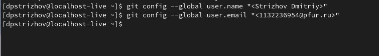
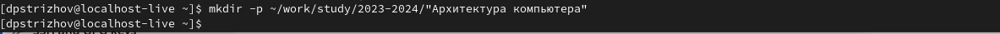
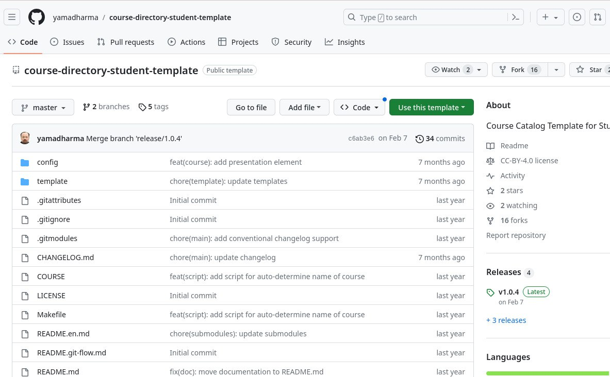
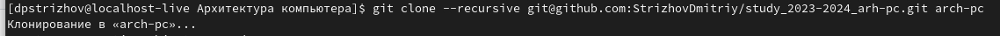
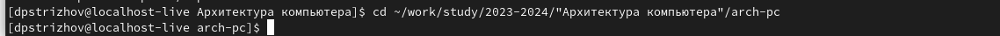
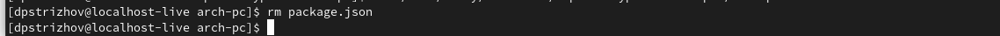
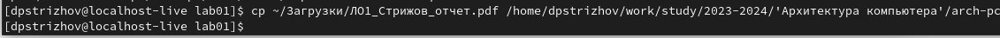
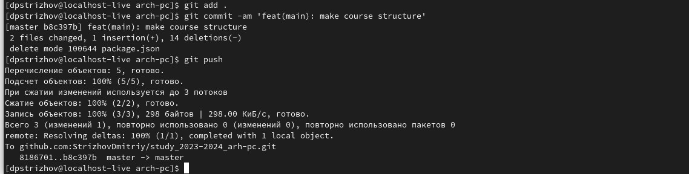

---
## Front matter
title: "Отчет по лабораторной работе №2"
subtitle: "Дисциплина: архитектура компьютера"
author: "Стрижов Дмитрий Павлович"

## Generic otions
lang: ru-RU
toc-title: "Содержание"

## Bibliography
bibliography: bib/cite.bib
csl: pandoc/csl/gost-r-7-0-5-2008-numeric.csl

## Pdf output format
toc: true # Table of contents
toc-depth: 2
fontsize: 12pt
linestretch: 1.5
papersize: a4
documentclass: scrreprt
## I18n polyglossia
polyglossia-lang:
  name: russian
  options:
	- spelling=modern
	- babelshorthands=true
polyglossia-otherlangs:
  name: english
## I18n babel
babel-lang: russian
babel-otherlangs: english
## Fonts
mainfont: PT Serif
romanfont: PT Serif
sansfont: PT Sans
monofont: PT Mono
mainfontoptions: Ligatures=TeX
romanfontoptions: Ligatures=TeX
sansfontoptions: Ligatures=TeX,Scale=MatchLowercase
monofontoptions: Scale=MatchLowercase,Scale=0.9
## Biblatex
biblatex: true
biblio-style: "gost-numeric"
biblatexoptions:
  - parentracker=true
  - backend=biber
  - hyperref=auto
  - language=auto
  - autolang=other*
  - citestyle=gost-numeric
## Pandoc-crossref LaTeX customization
figureTitle: "Рис."
## Misc options
indent: true
header-includes:
  - \usepackage{indentfirst}
  - \usepackage{float} # keep figures where there are in the text
  - \floatplacement{figure}{H} # keep figures where there are in the text
---

# Цель работы
Целью работы является изучить идеологию и применение средств контроля версий. Приобрести практические навыки по работе с системой git. 

# Задание

1. Базовая настройка git.
2. Создание SSH ключа.
3. Сознание рабочего пространства и репозитория курса на основе шаблона.
4. Сознание репозитория курса на основе шаблона.
5. Настройка каталога курса
6. Выполнение заданий для самостоятельной работы.

# Выполнение лабораторной работы
## **Базовая настройка git**
Создаю аккаунт на github и начинаю работу.

Для начала задаю мои имя и email (рис. @fig:001). Для этого используется команда git config --global.

{#fig:001 width=70%}

Настраиваем кодировку utf-8 в выводе сообщений, написав core.quotepath false (рис. @fig:002).

.jpeg){#fig:002 width=70%}
 
Задаем имя начальной ветки с помощью конфигурации init.defaultBranch и назовем её master (рис. @fig:003).
 
.jpeg){#fig:003 width=70%}

Задаем имя начальной ветки с помощью конфигурации init.defaultBranch и назовем её master (рис. @fig:004).
 
.jpeg){#fig:004 width=70%}

.jpeg){#fig:005 width=70%}

На этом и заканчивается базовая настройка git.

## **Создание SSH ключа**

Создаем ключ для дальнейшей идентификации пользователя на сервере репозиториев. Делаем это с помощью команды ssh-keygen -C, указывая имя пользователя и его почту, которые были заданы выше. В итоге ключ сохраняется в каталоге ~/.ssh/ (рис. @fig:006).

.jpeg){#fig:006 width=70%}

Копируем данный ключ (рис. @fig:007) для дальнейшей его загрузки на github. Загружаем на github (рис. @fig:008).

.jpeg){#fig:007 width=70%}

.jpeg){#fig:008 width=70%}

## **Сознание рабочего пространства и репозитория курса на основе шаблона**

Создаем каталог «Архитектура компьютеров» согласно указанной иерархии, делаю это с помощью команды mkdir и опции -p (рис. @fig:009).

{#fig:009 width=70%}

## **Сознание репозитория курса на основе шаблона**

Перехожу на страницу репозитория с шаблоном курса. Выбираю Use this template (рис. @fig:010).

{#fig:010 width=70%}

Открываю терминал и перехожу в каталог курса с помощью команды cd (рис. @fig:011).

.jpeg){#fig:011 width=70%}

Копирую репозиторий с github, используя команду git clone --recursive (рис. @fig:012).

{#fig:012 width=70%}

## **Настройка каталога курса**

Перехожу в каталог курса (рис. @fig:013).

{#fig:013 width=70%}

Удаляем лишние файлы (рис. @fig:014).

{#fig:014 width=70%}

Создаем необходимые каталоги (рис. @fig:015).

.jpeg){#fig:015 width=70%}

Добавляем файлы на сервер. Сочетание git add . и git commit -am сохраняет все изменения в каталоге, git push отправляет изменения на сервер.(рис. @fig:016, рис. @fig:017).

.jpeg){#fig:016 width=70%}

.jpeg){#fig:017 width=70%}

Проверяем иерархию файлов на github (рис. @fig:018, рис. @fig:019).

.jpeg){#fig:018 width=70%}

.jpeg){#fig:019 width=70%}

Убеждаемся, что всё сделано правильно.

## **Выполнение заданий для самостоятельной работы**

№1 Создаем отчет по выполнению лабораторной работы в соответствующем каталоге рабочего пространства (labs>lab02>report). Делаем это с помощью команды touch, предварительно перейдя в подкаталог report каталога lab02 (с помощью команды cd).В итоге сначала переходим в каталог arch-pc, используя cd .. , а затем cd labs/lab02/report. Далее используем touch.

№2 Копируем первую лабораторную работу в подкаталог report каталога lab01 (рис. @fig:020), предварительно узнав путь к файлу с отчетом по выполнению первой лабораторной работы с помощью команды ls(ряда её использования).

{#fig:020 width=70%}

№3 Загружаем файлы на github (рис. @fig:021).

{#fig:021 width=70%}

# Выводы

При выполнении данной лабораторной работы я изучил идеологию и применение средств контроля версий, а также приобрел практические навыки по работе с git.

# Список литературы{.unnumbered}

Git за полчаса: руководство для начинающих. Получено из proglib: https://proglib.io/p/git-for-half-an-hour?ysclid=lmz0qy2u6q207353842
