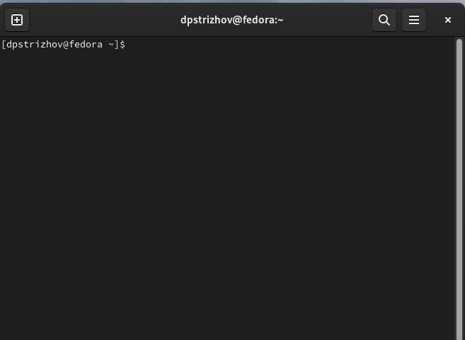
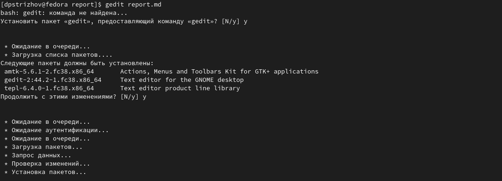
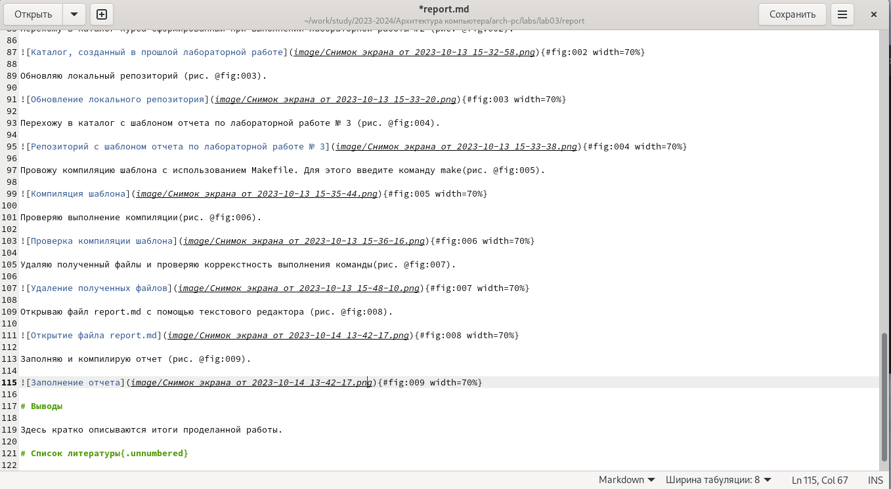

---
## Front matter
title: "Отчет по лабораторной работе №3"
subtitle: "Дисциплина: архитектура компьютера"
author: "Стрижов Дмитрий Палович"

## Generic otions
lang: ru-RU
toc-title: "Содержание"

## Bibliography
bibliography: bib/cite.bib
csl: pandoc/csl/gost-r-7-0-5-2008-numeric.csl

## Pdf output format
toc: true # Table of contents
toc-depth: 2
fontsize: 12pt
linestretch: 1.5
papersize: a4
documentclass: scrreprt
## I18n polyglossia
polyglossia-lang:
  name: russian
  options:
	- spelling=modern
	- babelshorthands=true
polyglossia-otherlangs:
  name: english
## I18n babel
babel-lang: russian
babel-otherlangs: english
## Fonts
mainfont: PT Serif
romanfont: PT Serif
sansfont: PT Sans
monofont: PT Mono
mainfontoptions: Ligatures=TeX
romanfontoptions: Ligatures=TeX
sansfontoptions: Ligatures=TeX,Scale=MatchLowercase
monofontoptions: Scale=MatchLowercase,Scale=0.9
## Biblatex
biblatex: true
biblio-style: "gost-numeric"
biblatexoptions:
  - parentracker=true
  - backend=biber
  - hyperref=auto
  - language=auto
  - autolang=other*
  - citestyle=gost-numeric
## Pandoc-crossref LaTeX customization
figureTitle: "Рис."
## Misc options
indent: true
header-includes:
  - \usepackage{indentfirst}
  - \usepackage{float} # keep figures where there are in the text
  - \floatplacement{figure}{H} # keep figures where there are in the text
---

# Цель работы

Целью работы является освоение процедуры оформления отчетов с помощью легковесного
языка разметки Markdown.

# Задание

1. Основная работа
2. Задания для самостоятельной работы 

# Выполнение лабораторной работы
Открываю терминал (рис. @fig:001).

{#fig:001 width=70%}

Перехожу в каталог курса сформированный при выполнении лабораторной работы №2 (рис. @fig:002).

{#fig:002 width=70%}

Обновляю локальный репозиторий (рис. @fig:003).

{#fig:003 width=70%}

Перехожу в каталог с шаблоном отчета по лабораторной работе № 3 (рис. @fig:004).

{#fig:004 width=70%}

Провожу компиляцию шаблона с использованием Makefile. Для этого введите команду make(рис. @fig:005).

{#fig:005 width=70%}

Проверяю выполнение компиляции(рис. @fig:006).

{#fig:006 width=70%}

Удаляю полученный файлы и проверяю коррекстность выполнения команды(рис. @fig:007).

{#fig:007 width=70%}

Открываю файл report.md c помощью текстового редактора (рис. @fig:008).

{#fig:008 width=70%}

Заполняю и компилирую отчет (рис. @fig:009).

{#fig:009 width=70%}

Отправляю отчет на Github.

#Выполнение заданий для самостоятельной работы 

Создаю отчет лабораторной №2, а затем отправляю её на github.

# Выводы

За время выполнения лабораторной работы я научился пользоваться языком разметки markdown и теперь могу писать отчет с его помощью.

# Список литературы{.unnumbered}

Синтаксис Mardown: подробная шпаргалка для веб-разработчиков: https://skillbox.ru/media/code/yazyk-razmetki-markdown-shpargalka-po-sintaksisu-s-primerami/?ysclid=lnpx5ixvcz437519880

