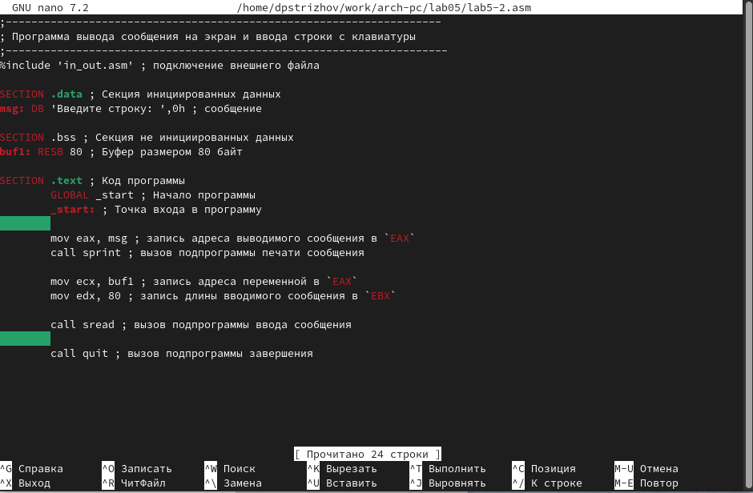

---
## Front matter
title: "Отчет по лабораторной работе №5"
subtitle: "Дисциплина: Архитектура компьютера"
author: "Стрижов Дмитрий Павлович"

## Generic otions
lang: ru-RU
toc-title: "Содержание"

## Bibliography
bibliography: bib/cite.bib
csl: pandoc/csl/gost-r-7-0-5-2008-numeric.csl

## Pdf output format
toc: true # Table of contents
toc-depth: 2
fontsize: 12pt
linestretch: 1.5
papersize: a4
documentclass: scrreprt
## I18n polyglossia
polyglossia-lang:
  name: russian
  options:
	- spelling=modern
	- babelshorthands=true
polyglossia-otherlangs:
  name: english
## I18n babel
babel-lang: russian
babel-otherlangs: english
## Fonts
mainfont: PT Serif
romanfont: PT Serif
sansfont: PT Sans
monofont: PT Mono
mainfontoptions: Ligatures=TeX
romanfontoptions: Ligatures=TeX
sansfontoptions: Ligatures=TeX,Scale=MatchLowercase
monofontoptions: Scale=MatchLowercase,Scale=0.9
## Biblatex
biblatex: true
biblio-style: "gost-numeric"
biblatexoptions:
  - parentracker=true
  - backend=biber
  - hyperref=auto
  - language=auto
  - autolang=other*
  - citestyle=gost-numeric
## Pandoc-crossref LaTeX customization
figureTitle: "Рис."
## Misc options
indent: true
header-includes:
  - \usepackage{indentfirst}
  - \usepackage{float} # keep figures where there are in the text
  - \floatplacement{figure}{H} # keep figures where there are in the text
---

# Цель работы

Приобретение практических навыков работы в Midnight Commander. Освоение инструкций
языка ассемблера mov и int.

# Задание

1. Начальная работа в Midnight Commander
2. Подключение внешнего файла in_out.asm
3. Задание для самостоятельной работы 

# Выполнение лабораторной работы
## Начальная работа в Midnight Commander

Открываю Midnight Commander и перехожу в ~/work/arch-pc и создаю каталог lab05, нажимая на клавишу F7 (рис. @fig:001).

{#fig:001 width=70%}

Создаю lab5-1.asm (рис. @fig:002).

{#fig:002 width=70%}

Открываю lab5-1.asm и ввожу текст программы (рис. @fig:003).

{#fig:003 width=70%}

Убеждаюсь в том, что в файле имеется код (рис. @fig:004).

{#fig:004 width=70%}

## Подключение внешнего файла in_out.asm

Скачиваю необходимый файл с ТУИСа, перемещаю его в директорию, где находятся мои программы. Создаю копию файла lab5-1.asm (рис. @fig:005).

{#fig:005 width=70%}

Испровляю текст программы lab5-2.asm, а затем меняю sprintLF на sprint (рис. @fig:006).

{#fig:006 width=70%}

Разница между первой и второй командой заключается в том, что при первой идет переход на следующую строку после вывода какой-то строки.

## Задание для самостоятельной работы 

№1 Создаю копию файла lab5-1.asm. Вношу изменения в программу (без использования внешнего файла in_out.asm), так чтобы она работала по следующему алгоритму(рис. @fig:007):
• вывести приглашение типа “Введите строку:”;
• ввести строку с клавиатуры;
• вывести введённую строку на экран.

{#fig:007 width=70%}

№2 Получаю исполняемый файл и проверяю его работу(рис. @fig:008).

{#fig:008 width=70%}

№3 Создаю копию файла lab5-2.asm. Исправляю текст программы с использование подпрограмм из внешнего файла in_out.asm, так чтобы она работала по следующему алгоритму(рис. @fig:009):
• вывести приглашение типа “Введите строку:”;
• ввести строку с клавиатуры;
• вывести введённую строку на экран.

{#fig:009 width=70%}

№4 Получаю исполняемый файл и проверяю его работу(рис. @fig:010).

{#fig:010 width=70%}

# Выводы

За время выполния данной лабораторной работы я основил инструкции ассемблера mov и int, а также получил навыки работы в Midnight Commander

# Список литературы{.unnumbered}

Осваиваем эффективную работу в Midnight Commander. Ссылка: https://interface31.ru/tech_it/2020/10/osvaivaem-effektivnuyu-rabotu-v-midnight-commander.html
