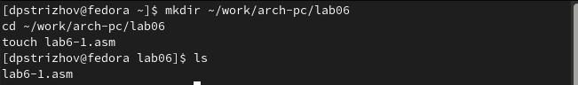
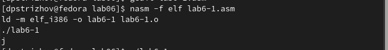
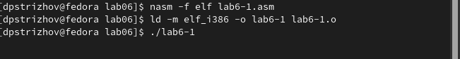
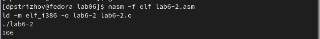
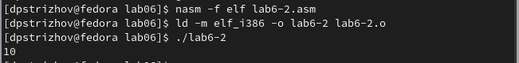
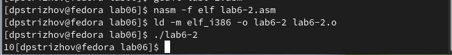
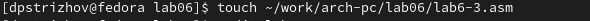
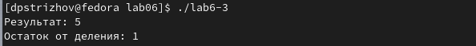
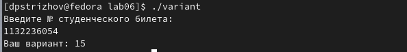
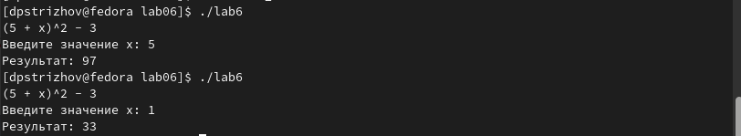

---
## Front matter
title: "Отчет по лабораторной работе №6"
subtitle: "Дисциплина: Архитектура компьютера"
author: "Стрижов Дмитрий Павлович"

## Generic otions
lang: ru-RU
toc-title: "Содержание"

## Bibliography
bibliography: bib/cite.bib
csl: pandoc/csl/gost-r-7-0-5-2008-numeric.csl

## Pdf output format
toc: true # Table of contents
toc-depth: 2
fontsize: 12pt
linestretch: 1.5
papersize: a4
documentclass: scrreprt
## I18n polyglossia
polyglossia-lang:
  name: russian
  options:
	- spelling=modern
	- babelshorthands=true
polyglossia-otherlangs:
  name: english
## I18n babel
babel-lang: russian
babel-otherlangs: english
## Fonts
mainfont: PT Serif
romanfont: PT Serif
sansfont: PT Sans
monofont: PT Mono
mainfontoptions: Ligatures=TeX
romanfontoptions: Ligatures=TeX
sansfontoptions: Ligatures=TeX,Scale=MatchLowercase
monofontoptions: Scale=MatchLowercase,Scale=0.9
## Biblatex
biblatex: true
biblio-style: "gost-numeric"
biblatexoptions:
  - parentracker=true
  - backend=biber
  - hyperref=auto
  - language=auto
  - autolang=other*
  - citestyle=gost-numeric
## Pandoc-crossref LaTeX customization
figureTitle: "Рис."
## Misc options
indent: true
header-includes:
  - \usepackage{indentfirst}
  - \usepackage{float} # keep figures where there are in the text
  - \floatplacement{figure}{H} # keep figures where there are in the text
---

# Цель работы

Освоение арифметических инструкций языка ассемблера NASM.

# Задание

1. Символьные и численные данне в NASM
2. Выполнение арифметических операций в NASM
3. Задание для самостоятельной работы

# Выполнение лабораторной работы
## Символьные и численные данне в NASM

Создаю каталог для программ лабораторной работы №6 и файл lab6-1.asm (рис. @fig:001).

{#fig:001 width=70%}

Пишем программу длы вывода значения регистра eax и создаем испольняемый файл (рис. @fig:002).

{#fig:002 width=70%}

Меняем программу, как указано в задании, символ на экране не отображается (рис. @fig:003).

{#fig:003 width=70%}

Создаю файл lab6-2.asm в каталоге ~/work/arch-pc/lab06 и ввожу в него текст программы из листинга 6.2 (рис. @fig:004).

{#fig:004 width=70%}

Создаю исполняемый файл (рис. @fig:005).

{#fig:005 width=70%}

Меняем в программе строковые значения на целочисленные, ответ равен 10 (рис. @fig:006). Функция iprintLF и iprint отличаются друг от друга тем, что в первом случае после вывода идет переход на следующую строку (рис. @fig:007).

{#fig:006 width=70%}

{#fig:007 width=70%}

## Выполнение арифметических операций в NASM

Создадим файл lab6-3.asm (рис. @fig:008).

{#fig:008 width=70%}

Создаю исполняемый файл lab6-3 и запускаю его (рис. @fig:009).

{#fig:009 width=70%}

Изменяю входные значения и запускаю компелирую lab6-3.asm снова (рис. @fig:010).

{#fig:010 width=70%}

Создаю файл variant.asm, куда я вписываю программу для подсчета варианта задания по номеру студенческого билета, создаю исполняемый файл и запускаю его (рис. @fig:011).

{#fig:011 width=70%}

1. mov eax,rem
   call sprint
2. Данные строки используются для считывания вводимой строки
3. call atoi используется для преобразования символа в число
4. xor edx,edx
   mov ebx,20
   div ebx
   inc edx
5. В регистр ebx
6. Для округления в правую сторону получамого числа 
7. mov eax,edx
   call iprintLF

## Задание для самостоятельной работы

Создаем программу для решения выражения 15-ого варианта, проверяем вычисления для двух x (рис. @fig:012).

{#fig:012 width=70%}

# Выводы

За время выполнения лабораторной работы я освоил арифметические функции ассемблера в NASM.

# Список литературы{.unnumbered}

Ввод данных с клавиатуры в ассемблере Источник: https://kivimsk.ru/vvod-dannyx-s-klaviatury-v-assemblere
