---
## Front matter
title: "Отчет по лабораторной работе №7"
subtitle: "Дисциплина: Архитектура компьютера"
author: "Стрижов Дмитрий Павлович"

## Generic otions
lang: ru-RU
toc-title: "Содержание"

## Bibliography
bibliography: bib/cite.bib
csl: pandoc/csl/gost-r-7-0-5-2008-numeric.csl

## Pdf output format
toc: true # Table of contents
toc-depth: 2
fontsize: 12pt
linestretch: 1.5
papersize: a4
documentclass: scrreprt
## I18n polyglossia
polyglossia-lang:
  name: russian
  options:
	- spelling=modern
	- babelshorthands=true
polyglossia-otherlangs:
  name: english
## I18n babel
babel-lang: russian
babel-otherlangs: english
## Fonts
mainfont: PT Serif
romanfont: PT Serif
sansfont: PT Sans
monofont: PT Mono
mainfontoptions: Ligatures=TeX
romanfontoptions: Ligatures=TeX
sansfontoptions: Ligatures=TeX,Scale=MatchLowercase
monofontoptions: Scale=MatchLowercase,Scale=0.9
## Biblatex
biblatex: true
biblio-style: "gost-numeric"
biblatexoptions:
  - parentracker=true
  - backend=biber
  - hyperref=auto
  - language=auto
  - autolang=other*
  - citestyle=gost-numeric
## Pandoc-crossref LaTeX customization
figureTitle: "Рис."
## Misc options
indent: true
header-includes:
  - \usepackage{indentfirst}
  - \usepackage{float} # keep figures where there are in the text
  - \floatplacement{figure}{H} # keep figures where there are in the text
---

# Цель работы

Изучение команд условного и безусловного переходов. Приобретение навыков написания
программ с использованием переходов. Знакомство с назначением и структурой файла
листинга.

# Задание

1. Реализация переходов в NASM
2. Изучения структуры файла листинга
3. Задания для самостоятельной работы 

# Выполнение лабораторной работы
## Реализация переходов в NASM
Создаю каталог для программ лабораторной работы № 7, перехожу в него и создаю файл lab7-1.asm (рис. @fig:001).

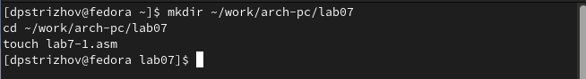{#fig:001 width=70%}

Копирую программу из листинга 7.1, создаю исполнительный файл и запускаю его (рис. @fig:002).

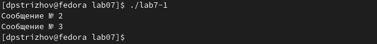{#fig:002 width=70%}

Изменяю программу таким образом, что сначала выводилось "Сообщение №2", а затем "Сообщение №1" (рис. @fig:003, рис. @fig:004).

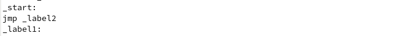{#fig:003 width=70%}

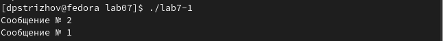{#fig:004 width=70%}

Изменяю программу так, чтобы программа выводила "Сообщение №1", затем "Сообщение №2", а в конце "Сообщение №1" (рис. @fig 005).

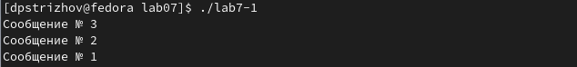{#fig:005 width=70%}

Изменяю программу так, чтобы программа выводила "Сообщение №1", затем "Сообщение №2", а в конце "Сообщение №1" (рис. @fig:006).

{#fig:006 width=70%}

Копирую программу из листинга 7.2, создаю исполнительный файл и запускаю его (рис. @fig:007).

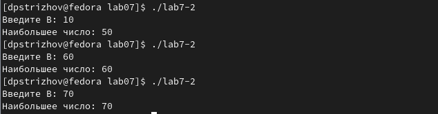{#fig:007 width=70%}

## Изучения структуры файла листинга

Создаю листинг программы (рис. @fig:008).

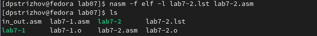{#fig:008 width=70%}

Открываю листинг (рис. @fig:009).

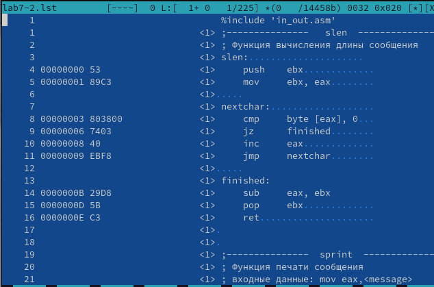{#fig:009 width=70%}

Открываю листинг (рис. @fig:010).

{#fig:010 width=70%}

Рассмотрим данные команды:
00000122 7F0C                    jg check_B ; если 'A>C', то переход на метку 'check_B',
00000124 8B0D[39000000]          mov ecx,[C] ; иначе 'ecx = C'
0000012A 890D[00000000]          mov [max],ecx ; 'max = C'
код 00000122 и прочие означают очередность выполнение данной команды, а коды 7F0C и прочие означают машинные коды команд.

Убираю в инструкции один операнд, на выходе ничего не получаем, а в листинге в месте, где мы "ломаем" программу пропадают коды (рис. @fig:011).

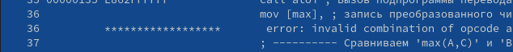{#fig:011 width=70%}

## Задания для самостоятельной работы
№1 Создаю программу, которая ищет наименьшее число из трех и выводит его (рис. @fig:012).

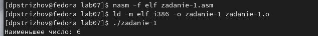{#fig:012 width=70%}

№2 Создаю программу, которая вычисляет функции для x и a (рис. @fig:013).

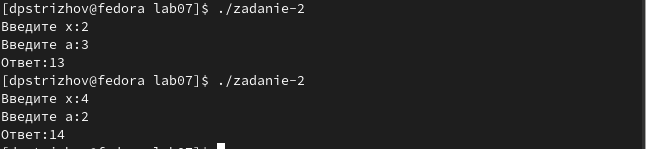{#fig:013 width=70%}

# Выводы

За время выполнения лабораторной работы я изучил команды условного и безусловного перехода, а также познакомился со структурой и назначением листинга.

# Список литературы{.unnumbered}

Учебный курс. Часть 16. Условные и безусловные переходы. Источник: https://fasmworld.ru/uchebnyj-kurs/016-uslovnye-i-bezuslovnye-perexody/?ysclid=lpebbedbxn212955187
