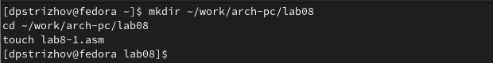
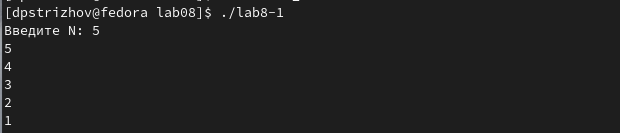
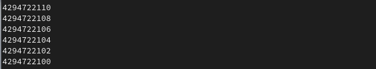
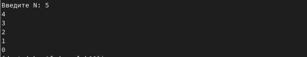
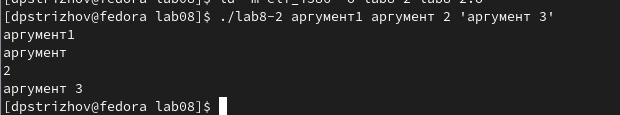
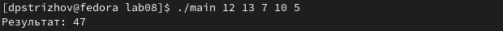
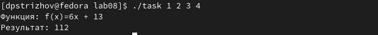

---
## Front matter
title: "Отчет по лабораторной работе №8"
subtitle: "Дисциплина: Архитектура компьютера"
author: "Стрижов Дмитрий Павлович"

## Generic otions
lang: ru-RU
toc-title: "Содержание"

## Bibliography
bibliography: bib/cite.bib
csl: pandoc/csl/gost-r-7-0-5-2008-numeric.csl

## Pdf output format
toc: true # Table of contents
toc-depth: 2
fontsize: 12pt
linestretch: 1.5
papersize: a4
documentclass: scrreprt
## I18n polyglossia
polyglossia-lang:
  name: russian
  options:
	- spelling=modern
	- babelshorthands=true
polyglossia-otherlangs:
  name: english
## I18n babel
babel-lang: russian
babel-otherlangs: english
## Fonts
mainfont: PT Serif
romanfont: PT Serif
sansfont: PT Sans
monofont: PT Mono
mainfontoptions: Ligatures=TeX
romanfontoptions: Ligatures=TeX
sansfontoptions: Ligatures=TeX,Scale=MatchLowercase
monofontoptions: Scale=MatchLowercase,Scale=0.9
## Biblatex
biblatex: true
biblio-style: "gost-numeric"
biblatexoptions:
  - parentracker=true
  - backend=biber
  - hyperref=auto
  - language=auto
  - autolang=other*
  - citestyle=gost-numeric
## Pandoc-crossref LaTeX customization
figureTitle: "Рис."
## Misc options
indent: true
header-includes:
  - \usepackage{indentfirst}
  - \usepackage{float} # keep figures where there are in the text
  - \floatplacement{figure}{H} # keep figures where there are in the text
---
# Цель работы

Приобретение навыков написания программ с использованием циклов и обработкой
аргументов командной строки.

# Задание

1. Реализация циклов в NASM
2. Обработка аргументов командной строки
3. Задание для самостоятельной работы

# Выполнение лабораторной работы
## Реализация циклов в NASM

Создаю каталог для программам лабораторной работы № 8, перехожу в него и создаю
файл lab8-1.asm(рис. @fig:001).

{#fig:001 width=70%}

Ввожу в файл lab8-1.asm текст программы из листинга 8.1. Создаю исполняемый файл
и проверяю его работу(рис. @fig:002).

{#fig:002 width=70%}

Меняю программу так, чтобы регистр ecx менялся внутри цикла и получаю сломанную программу, так как количество проходов цикла не соответствует значению N(рис. @fig:003).

{#fig:003 width=70%}

Меняем программу так, чтобы можно было и изменять регистр ecx, тогда количество выведенных значений соответстует N(рис. @fig:004).

{#fig:004 width=70%}

## Обработка аргументов командной строки

Создаю файл lab8-2.asm в каталоге ~/work/arch-pc/lab08 и ввожу в него текст программы из листинга 8.2(рис. @fig:005). В итоге было обработано 4 аргумента. 

{#fig:005 width=70%}

Создаю программу, которая складывает все числа из стека(рис. @fig:006). 

{#fig:006 width=70%}

## Задание для самостоятельной работы

Создаю программу, которая вычисляет значения функции для разных x и складывает их значения(рис. @fig:007). 

{#fig:007 width=70%}

# Выводы

За время выполнения данной лабораторной работы я приобрел навыки написания программ с использованием циклов и обработкой аргументов командной строки. 

# Список литературы{.unnumbered}

"Циклы". Источник: https://metanit.com/assembler/tutorial/4.5.php?ysclid=lpodb22kzv21631927
