---
## Front matter
title: "Отчет по лабораторной работе №8"
subtitle: "Дисциплина: Архитектура компьютера"
author: "Стрижов Дмитрий Павлович"

## Generic otions
lang: ru-RU
toc-title: "Содержание"

## Bibliography
bibliography: bib/cite.bib
csl: pandoc/csl/gost-r-7-0-5-2008-numeric.csl

## Pdf output format
toc: true # Table of contents
toc-depth: 2
fontsize: 12pt
linestretch: 1.5
papersize: a4
documentclass: scrreprt
## I18n polyglossia
polyglossia-lang:
  name: russian
  options:
	- spelling=modern
	- babelshorthands=true
polyglossia-otherlangs:
  name: english
## I18n babel
babel-lang: russian
babel-otherlangs: english
## Fonts
mainfont: PT Serif
romanfont: PT Serif
sansfont: PT Sans
monofont: PT Mono
mainfontoptions: Ligatures=TeX
romanfontoptions: Ligatures=TeX
sansfontoptions: Ligatures=TeX,Scale=MatchLowercase
monofontoptions: Scale=MatchLowercase,Scale=0.9
## Biblatex
biblatex: true
biblio-style: "gost-numeric"
biblatexoptions:
  - parentracker=true
  - backend=biber
  - hyperref=auto
  - language=auto
  - autolang=other*
  - citestyle=gost-numeric
## Pandoc-crossref LaTeX customization
figureTitle: "Рис."
## Misc options
indent: true
header-includes:
  - \usepackage{indentfirst}
  - \usepackage{float} # keep figures where there are in the text
  - \floatplacement{figure}{H} # keep figures where there are in the text
---

# Цель работы

Приобретение навыков написания программ с использованием подпрограмм. Знакомство
с методами отладки при помощи GDB и его основными возможностями.

# Задание

1. Реализация подпрограмм в NASM
2. Отладка программам с помощью GDB
3. Задание для самостоятельной работы

# Выполнение лабораторной работы
## Реализация подпрограмм в NASM
Создаю каталог для выполнения лабораторной работы № 9, перехожу в него и создаю файл lab09-1.asm (рис. @fig:001).

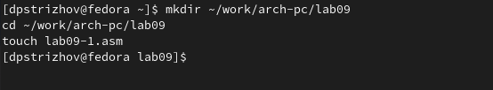{#fig:001 width=70%}

Копирую программу из листинга 1, добавляю подпрограмму _subcalcul, которая вычисляет функцию g(x) (рис. @fig:002).

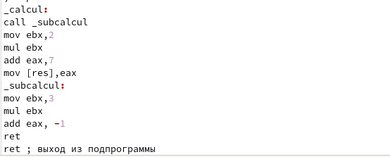{#fig:002 width=70%}

Вот что получается в итоге (рис. @fig:003).

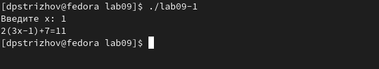{#fig:003 width=70%}

## Отладка программам с помощью GDB

Создаю файл lab09-2.asm, куда вписываю программу из листинга 2 (рис. @fig:004, рис. @fig:005).

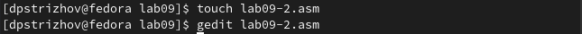{#fig:004 width=70%}

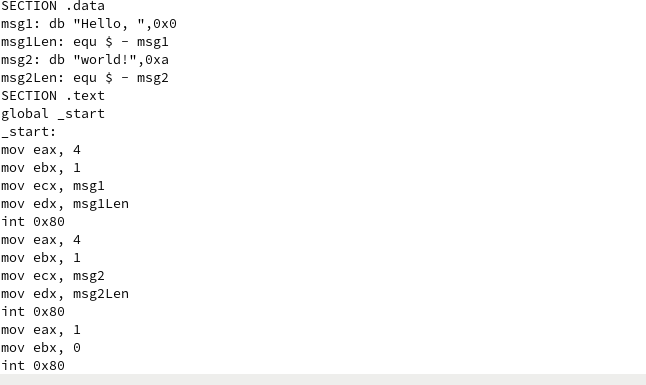{#fig:005 width=70%}

Получаю исполняемый файл, при этом указывая ключ "-g" для работы с GDB (рис. @fig:006).

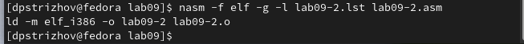{#fig:006 width=70%}

Загружаю исполняемый файл в отладчик (рис. @fig:007).

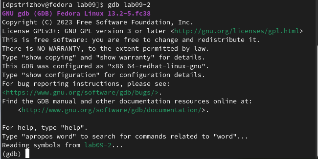{#fig:007 width=70%}

Проверяю работы программы (рис. @fig:008).

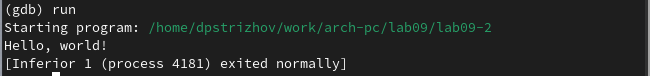{#fig:008 width=70%}

Ставим метку и снова запускаем программу (рис. @fig:009).

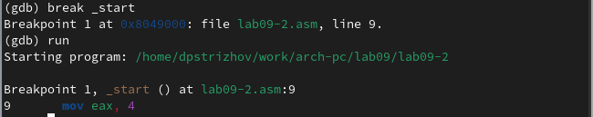{#fig:009 width=70%}

Просматриваю дисассимилированный код программы с помощью команды disassemble начиная с метки _start (рис. @fig:010).

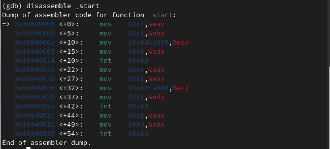{#fig:010 width=70%}

Переключаюсь на отображение команд с Intel’овским синтаксисом, введя команду set disassembly-flavor intel, различия отображения в синтаксисе ATT, а именно знак % перед регистром и регистры при написании программ меняются местами, например, в при выполнении команды mov значения из первого регистра переходят во второй (рис. @fig:011).

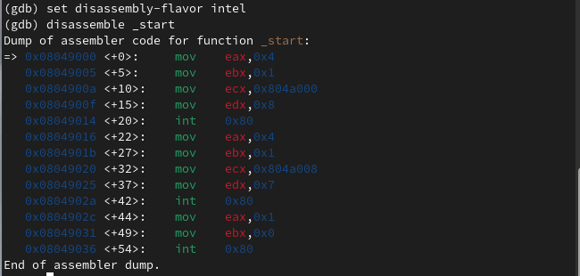{#fig:011 width=70%}

Включаю режим псевдографики для более удобного анализа программы  (рис. @fig:012).

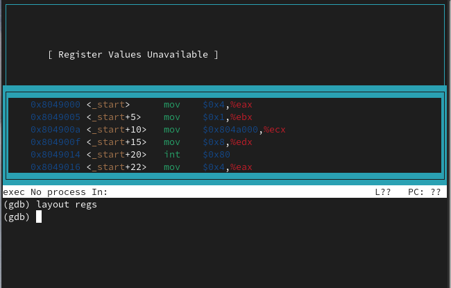{#fig:012 width=70%}

Проверяю точку останова (рис. @fig:013).

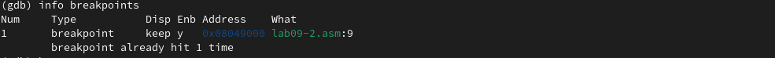{#fig:013 width=70%}

Установка новой точки останова (рис. @fig:014).

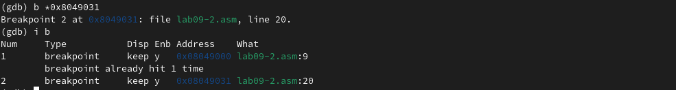{#fig:014 width=70%}

Смотрю содержимое переменной msg1 (рис. @fig:015).

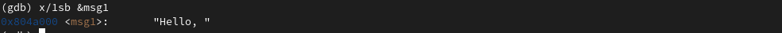{#fig:015 width=70%}

Смотрю значение переменной msg2 (рис. @fig:016).

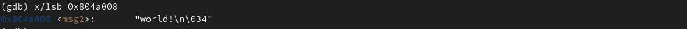{#fig:016 width=70%}

Изменяем значения переменной msg1 (рис. @fig:017).

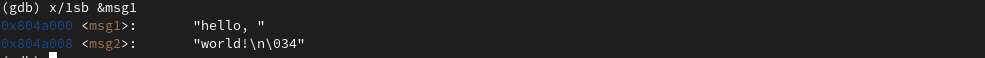{#fig:017 width=70%}

Делаю то же самое с переменной msg2 (рис. @fig:018).

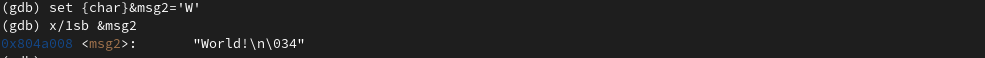{#fig:018 width=70%}

Меняю значение регистра ebx (рис. @fig:019).

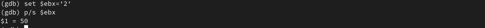{#fig:019 width=70%}

И снова, причина разницы значений заключается в том, что в первом случае мы передаем строку, а во втором число (рис. @fig:020).

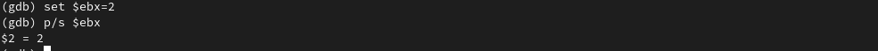{#fig:020 width=70%}

Копирую файл lab8-2.asm, созданный при выполнении лабораторной работы №8, с программой выводящей на экран аргументы командной строки (Листинг 8.2) в файл с именем lab09-3.asm(рис. @fig:021).

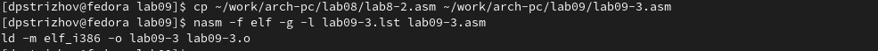{#fig:021 width=70%}

Загружаю программу в отладчик, устанавлюваю точку останова и запускаю программу (рис. @fig:022).

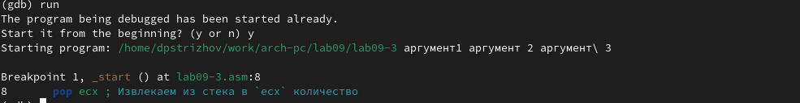{#fig:022 width=70%}

Смотрим, что находиться в регистре esp (стек) (рис. @fig:023).

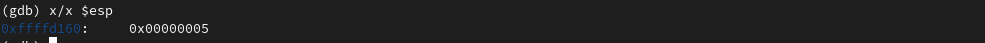{#fig:023 width=70%}

Рассматриваем прочие значения стека (рис. @fig:024).

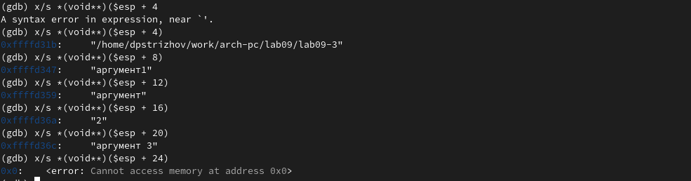{#fig:024 width=70%}

Знак изменения равен 4, вероятно, потому, что адрес записывается в 16-тиричной системе исчесления. 

## Задание для самостоятельной работы

1. Меняю программу, добавляя подпрограмму, которая считает функцию отдельно (рис. @fig:025).

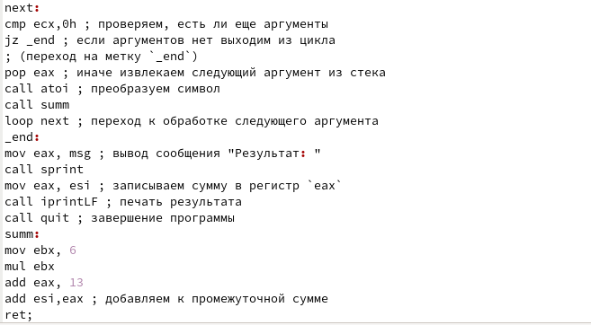{#fig:025 width=70%}

Получаю следующий результат (рис. @fig:026).

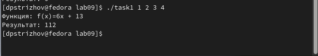{#fig:026 width=70%}

2. Меняю программу из листинга, чтобы выводился правильный результат (рис. @fig:027).

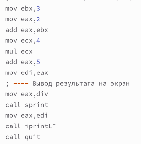{#fig:027 width=70%}

Проверяю её исполнение и получаю правильный результат (рис. @fig:028).

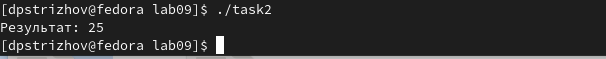{#fig:028 width=70%} 

# Выводы

За время выпонения работы я получил навыки написания программ с использованием подпрограмм и познакомился с методами отладки с помощью GDB и его основными осоьенностями. 

# Список литературы{.unnumbered}

Debugging assembly with GDB. Источник: https://ncona.com/2019/12/debugging-assembly-with-gdb/
