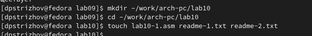
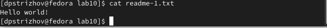
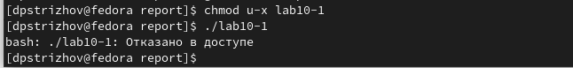
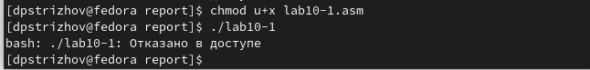
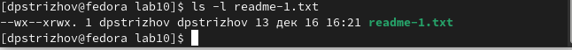
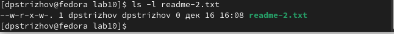
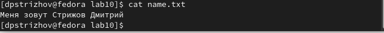

---
## Front matter
title: "Отчет по лабораторной работе №8"
subtitle: "Дисциплина: Архитектура компьютера"
author: "Стрижов Дмитрий Павлович"

## Generic otions
lang: ru-RU
toc-title: "Содержание"

## Bibliography
bibliography: bib/cite.bib
csl: pandoc/csl/gost-r-7-0-5-2008-numeric.csl

## Pdf output format
toc: true # Table of contents
toc-depth: 2
fontsize: 12pt
linestretch: 1.5
papersize: a4
documentclass: scrreprt
## I18n polyglossia
polyglossia-lang:
  name: russian
  options:
	- spelling=modern
	- babelshorthands=true
polyglossia-otherlangs:
  name: english
## I18n babel
babel-lang: russian
babel-otherlangs: english
## Fonts
mainfont: PT Serif
romanfont: PT Serif
sansfont: PT Sans
monofont: PT Mono
mainfontoptions: Ligatures=TeX
romanfontoptions: Ligatures=TeX
sansfontoptions: Ligatures=TeX,Scale=MatchLowercase
monofontoptions: Scale=MatchLowercase,Scale=0.9
## Biblatex
biblatex: true
biblio-style: "gost-numeric"
biblatexoptions:
  - parentracker=true
  - backend=biber
  - hyperref=auto
  - language=auto
  - autolang=other*
  - citestyle=gost-numeric
## Pandoc-crossref LaTeX customization
figureTitle: "Рис."
## Misc options
indent: true
header-includes:
  - \usepackage{indentfirst}
  - \usepackage{float} # keep figures where there are in the text
  - \floatplacement{figure}{H} # keep figures where there are in the text
---

# Цель работы

Приобретение навыков написания программ для работы с файлами.

# Задание

1. Работа с правами доступа к файлам 
2. Задания для самостоятельной работы

# Выполнение лабораторной работы
## Работа с правами доступа к файлам 
Проводим предварительную подготовку (рис. @fig:001).

{#fig:001 width=70%}

Ввожу в файл lab10-1.asm программу из листинга 10.1, создаю исполняемый файл и проверяю его работу (рис. @fig:002).

{#fig:002 width=70%}

Меняю права исполняемого файла (рис. @fig:003).

{#fig:003 width=70%}

Меняю права файла lab10-1.asm, результат не меняется, потому что этот файл уже никак не связан с исполняемым (рис. @fig:004).

{#fig:004 width=70%}

В соответствии с мои вариантом меняю права доступа у файлов readme-1.txt и readme-2.txt (рис. @fig:005, @fig:006).

{#fig:005 width=70%}

{#fig:006 width=70%}

## Задания для самостоятельной работы

Cоздаю программу, которая работает по следующему алгоритму:
• Вывод приглашения “Как Вас зовут?”
• ввести с клавиатуры свои фамилию и имя
• создать файл с именем name.txt
• записать в файл сообщение “Меня зовут”
• дописать в файл строку введенную с клавиатуры
• закрыть файл
Создаю исполняемый файл и проверяю его работу (рис. @fig:007).

{#fig:007 width=70%}

# Выводы

За время выполнения лабораторной работы я научился писать программы для работы с файлами

# Список литературы{.unnumbered}
Работа с файлами на языке Ассемблер. Источник: https://scienceforum.ru/2020/article/2018018043?ysclid=lqat1rtmiv386940603

